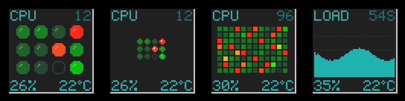

# wmcoremap

[](https://github.com/michaelsternberg/wmcoremap/actions/workflows/build.yml)

A per-core CPU heatmap dockapp for [Window Maker](https://www.windowmaker.org/).



Most CPU dockapps were designed when a machine had one to four CPUs.
wmcoremap draws every logical CPU as one LED in a grid that fills the
64x64 tile, so it works the same for 4, 12 or 96 cores. Each LED is a
heatmap in the colours of wmsysmon's LEDs: dark grey-green when the CPU is
idle, bright green under moderate load, then yellow, orange and red as it
gets close to 100%. Total CPU use and the CPU
temperature are shown below the grid in the 5x7 sea-green LED style of
wmtop and other classic dockapps.

```
+----------------+
|CPU           12|   screen name, CPU count
|   o  o  o  o   |
|   o  o  O  @   |   one LED per logical CPU
|   o  o  o  o   |
|26%        41`C |   total CPU %, temperature
+----------------+
```

`-size` sets the LED size with one of three words: `small` (4x4 pixels
with the corners cut off, spaced 1 pixel apart, exactly like wmsysmon's
LEDs), `medium` (6x6) or `large` (9x9, the default). When there are too
many CPUs for the chosen size, the LEDs shrink to fit: 32 CPUs get at most
6 pixel LEDs, 64 CPUs wmsysmon-sized ones, 96 CPUs a 12x8 grid of 3 pixel
squares, and 256 CPUs single pixels. A CPU that has been
taken offline is drawn as a hollow ring.

## Screens

Left-click (or the mouse wheel) cycles through the screens. The name of the
current screen is shown in the top left corner.

| Screen | Shows |
|--------|-------|
| `CPU`  | the per-core heatmap; the number at the right is the CPU count |
| `LOAD` | total CPU % over the last 54 samples (54 s by default) |
| `TEMP` | CPU temperature over the last 54 samples; only when a sensor is found |
| `GPU`  | GPU busy % over time and VRAM use; only for AMD cards on the `amdgpu` driver |

## Requirements

- libX11, libXext and their development headers
  - Debian / Ubuntu: `sudo apt install libx11-dev libxext-dev pkg-config`

## Installing

On Debian 13 (trixie) and derivatives, download the `.deb` from the
[latest release](https://github.com/michaelsternberg/wmcoremap/releases/latest)
and install it with apt:

```sh
sudo apt install ./wmcoremap_*_amd64.deb
```

## Building

```sh
make
sudo make install        # PREFIX=/usr/local by default; DESTDIR is honoured
```

To build the Debian package yourself (needs `debhelper`):

```sh
dpkg-buildpackage -us -uc -b      # writes ../wmcoremap_<version>_amd64.deb
```

## Usage

```
wmcoremap [options]

  -c, -celsius / -f, -fahrenheit   temperature unit (default Celsius)
  -interval MS                     update period (default 1000)
  -screen cpu|load|temp|gpu        first screen (default cpu)
  -sensor PATH                     temperature input file (default: auto-detect)
  -fg COLOR / -bg COLOR            text / background colour
  -size small|medium|large         LED size (default large)
  -square                          square cells instead of round LEDs
  -fake N                          simulate N CPUs (for trying out layouts)
  -display DISPLAY                 X display to use
```

Try `wmcoremap -fake 96` to see how a large machine would look.

## Mouse

| Action     | Effect                       |
|------------|------------------------------|
| Left       | next screen                  |
| Wheel      | previous / next screen       |
| Right      | switch Celsius / Fahrenheit  |

## Temperature sensor

wmcoremap looks for the CPU temperature in `/sys/class/hwmon`, trying these
drivers in order: `k10temp` (AMD; the `Tctl` / `Tdie` input), `zenpower`,
`coretemp` (Intel; `Package id 0`), `cpu_thermal` and `soc_thermal` (ARM
boards). If none of them is present it falls back to the `x86_pkg_temp` or
`acpitz` thermal zone. If no sensor is found, the temperature and the `TEMP`
screen are left out. To pick a sensor yourself, point `-sensor` at any
`temp*_input` file:

```sh
grep . /sys/class/hwmon/hwmon*/name      # list the drivers
wmcoremap -sensor /sys/class/hwmon/hwmon1/temp1_input
```

## GPU screen

The `GPU` screen reads `gpu_busy_percent` and `mem_info_vram_*` from the
first `/sys/class/drm/card*/device` that has them. Only the `amdgpu` kernel
driver provides these files. Older Radeon cards on the `radeon` driver,
NVIDIA and Intel GPUs do not, and the screen is left out.

## How it works

Each tick wmcoremap reads `/proc/stat`. A CPU's load is the share of time
it was not idle or waiting for I/O since the last tick. The new value is
averaged with the previous one so the LEDs do not flicker. The tile is drawn
into a 64x64 framebuffer and pushed to the dockapp's icon window, all in one
`poll()` loop on the X connection.

## Contributing

Bug reports and patches are welcome; see [CONTRIBUTING.md](CONTRIBUTING.md).
Changes between versions are listed in [CHANGELOG.md](CHANGELOG.md).

## License

GPL version 2 or later; see [COPYING](COPYING).
